# An implementation of Deep Markov Model (DMM) for Air Quality forecasting

[](https://opensource.org/licenses/MIT)
[](https://www.python.org/downloads/)
[](https://pytorch.org/)
[](https://pyro.ai/)

## DMM: a mathematical Background

Deep Markov Models combine the interpretability of state-space models with the expressiveness of deep neural networks.

### Generative Model

The DMM defines a joint distribution over observations $x_{1:T}$ and latent states $z_{1:T}$:

$$p(x_{1:T}, z_{1:T}) = p(z_1) \prod_{t=2}^{T} p(z_t | z_{t-1}) \prod_{t=1}^{T} p(x_t | z_t)$$

Where:
- **Transition prior** $p(z_t | z_{t-1})$: Models latent dynamics via `GatedTransition`
- **Emission likelihood** $p(x_t | z_t)$: Maps latent states to observations via `Emitter`

### Variational Guide

The approximate posterior uses an RNN to encode observation context:

$$q(z_{1:T} | x_{1:T}) = \prod_{t=1}^{T} q(z_t | z_{t-1}, h_t^{rnn})$$

Where $h_t^{rnn}$ captures information from the observation sequence via a backward RNN.

### Components

| Component | Distribution | Parameters | Description |
|-----------|-------------|------------|-------------|
| `GatedTransition` | $p(z_t \| z_{t-1})$ | $(\mu, \sigma)$ | Gated neural network for latent dynamics |
| `Emitter` | $p(x_t \| z_t)$ | $(\mu, \sigma)$ | MLP mapping latent to observation space |
| `Combiner` | $q(z_t \| z_{t-1}, h)$ | $(\mu, \sigma)$ | Fuses prior and RNN context for posterior |

All distributions are diagonal Gaussians parameterized by neural networks.

## Architecture

```
dmm/
├── __init__.py          # Package exports
├── config.py            # Configuration dataclasses
├── models/
│   ├── base.py          # Abstract interfaces (BaseTransition, BaseEmitter, BaseCombiner)
│   ├── components.py    # Concrete implementations (GatedTransition, Emitter, Combiner)
│   ├── dmm.py           # DeepMarkovModel (PyroModule)
│   └── factory.py       # DMMFactory for model creation
├── training/
│   └── trainer.py       # DMMTrainer (SVI with Trace_ELBO)
├── inference/
│   └── forecaster.py    # DMMForecaster (latent inference & prediction)
├── data/
│   ├── preprocessing.py # Z-score normalization, NaN handling
│   └── dataset.py       # Sequence building, train/test splits
├── analysis/
│   └── interpreter.py   # DMMInterpreter (latent space analysis)
└── visualization/
    └── plots.py         # Training curves, forecasts, diagnostics
```


## Results

### Training Convergence

The model is trained using Stochastic Variational Inference (SVI) with the ELBO (Evidence Lower Bound) objective.

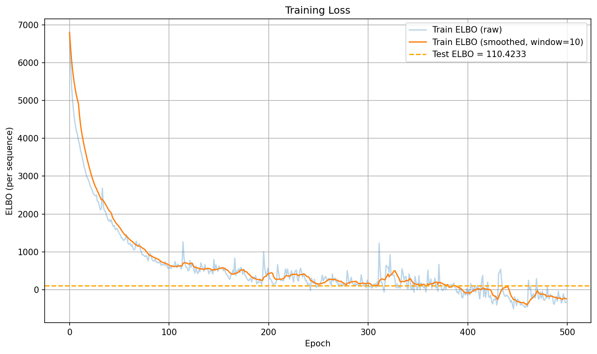

**Training Loss Curve**: Shows the negative ELBO over training epochs. The decreasing trend indicates the model is learning to better approximate the true posterior distribution. Lower values represent better model fit, with the final test ELBO providing a measure of generalization.

---

### Probabilistic Forecasting

The DMM generates 7-day (168-hour) probabilistic forecasts with 90% confidence intervals for each environmental variable.

#### PM10 (Particulate Matter)
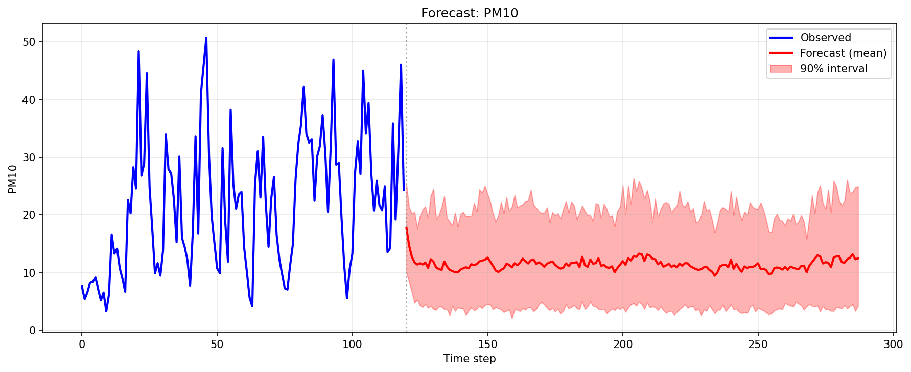

**PM10 Forecast**: Predicts particulate matter concentration (μg/m³). The shaded region represents the 90% prediction interval, capturing uncertainty in air quality forecasts. PM10 is a key indicator of air pollution with significant health implications.

#### Temperature
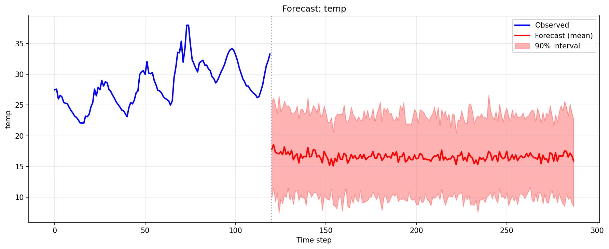

**Temperature Forecast**: Predicts ambient temperature with uncertainty bounds. The model captures diurnal patterns (day/night cycles) and provides calibrated uncertainty estimates for temperature variations.

#### Humidity
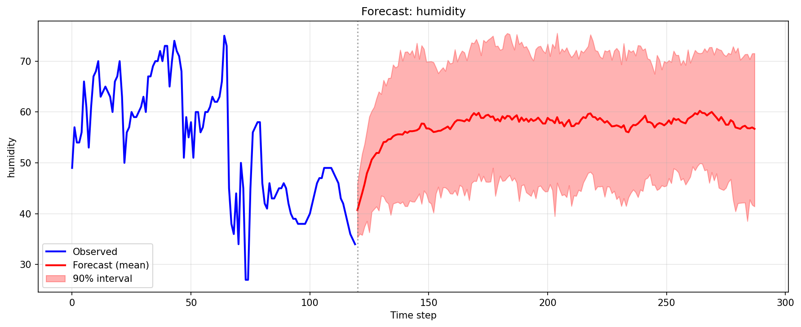

**Humidity Forecast**: Predicts relative humidity levels. Humidity is inversely correlated with temperature and affects pollutant dispersion, making it crucial for comprehensive air quality modeling.

#### Rainfall
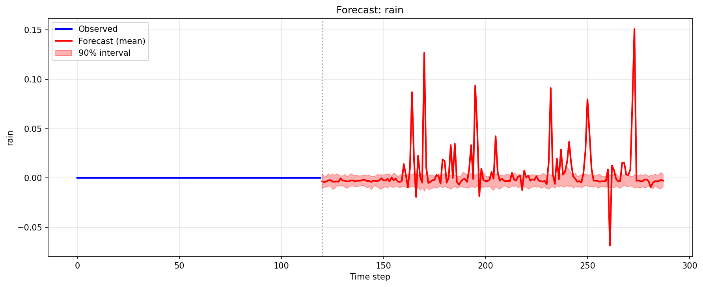

**Rainfall Forecast**: Predicts precipitation levels. Rain events significantly impact air quality by washing out particulates, and the model captures this relationship in the learned latent dynamics.

#### Wind Speed
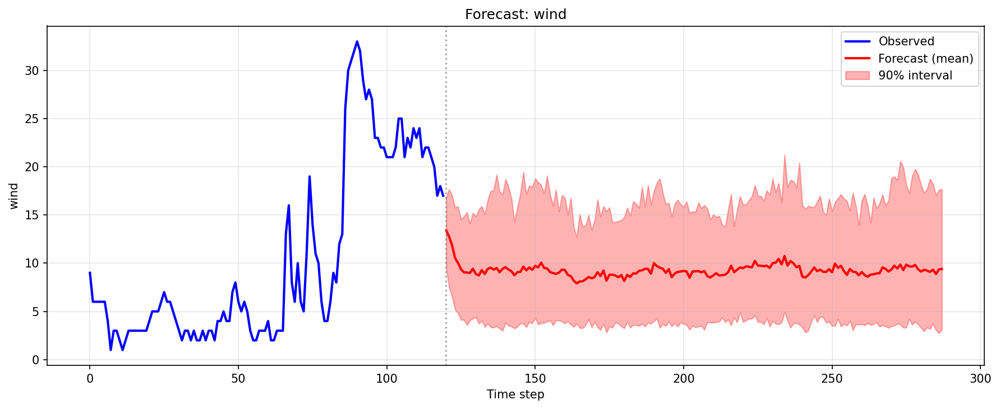

**Wind Speed Forecast**: Predicts wind speed with uncertainty. Wind is a primary driver of pollutant dispersion, and the model learns its complex temporal patterns and relationship with other variables.

---

### Latent Space Analysis

The DMM learns a 16-dimensional latent space that captures the underlying dynamics of the environmental system.

#### Feature-Latent Correlations
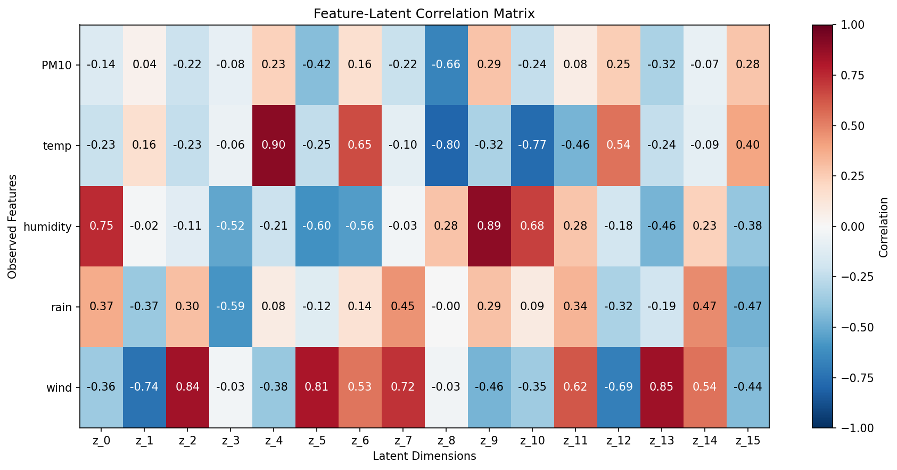

**Feature-Latent Correlation Heatmap**: Visualizes how each observed feature (PM10, temperature, humidity, rain, wind) correlates with the 16 latent dimensions. Strong correlations (red/blue) indicate which latent dimensions encode specific environmental phenomena. This interpretability analysis reveals that different latent dimensions specialize in capturing different aspects of the data.

#### Latent Space Trajectory
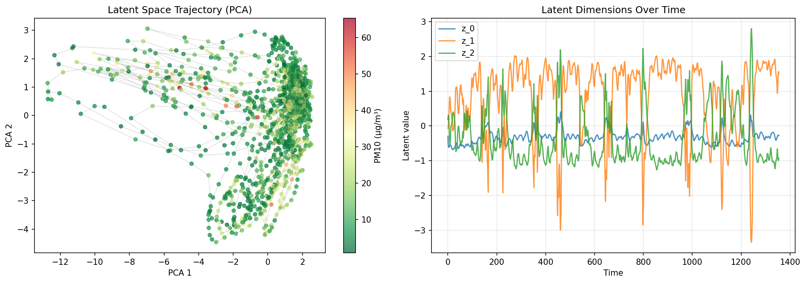

**Latent Space Trajectory (PCA Projection)**: Projects the 16-dimensional latent trajectories onto 2D using Principal Component Analysis. Points are colored by PM10 concentration, revealing how the model organizes air quality states in the latent space. Clusters indicate distinct environmental regimes, while smooth transitions show temporal evolution.

#### Regime Characteristics
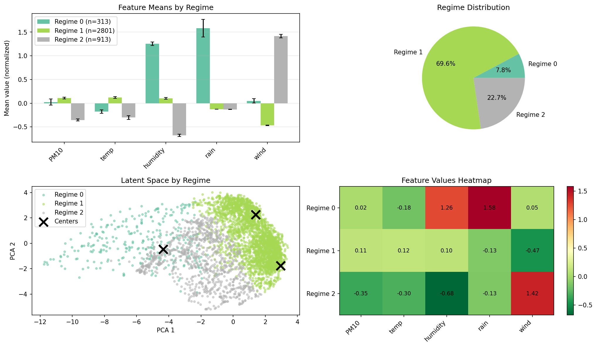

**Pollution Regime Characteristics**: The model identifies 3 distinct environmental regimes through k-means clustering in latent space. This visualization shows the average characteristics of each regime across all variables, revealing patterns like "high pollution + low wind" or "clean air + high humidity" states.

#### Regime Timeline
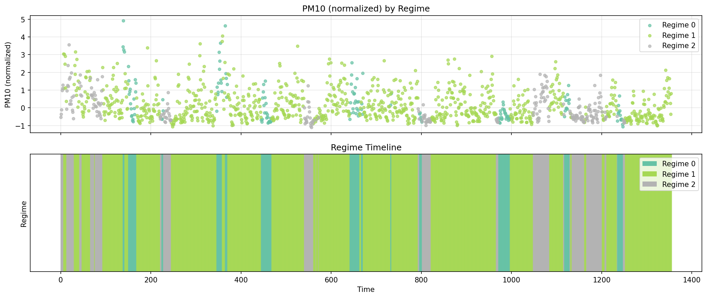

**Regime Timeline**: Shows how the environmental system transitions between regimes over time. The top panel displays the PM10 time series, while the bottom panel shows the regime assignment at each timestep. This reveals temporal patterns in regime persistence and transition dynamics.

#### Anomaly Detection
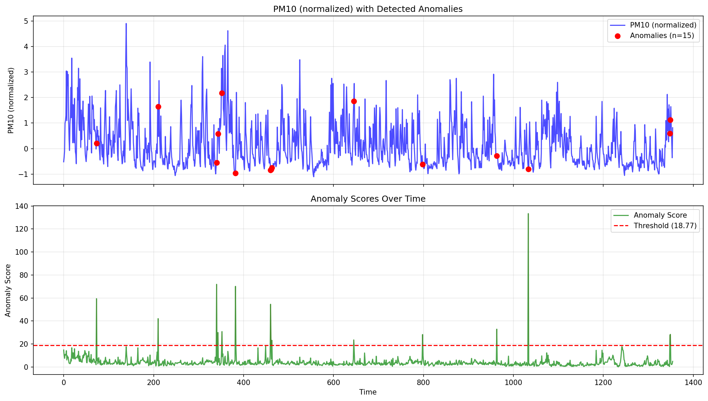

**Anomaly Detection**: Identifies unusual observations based on reconstruction error. Points where the model's prediction deviates significantly from observations (beyond 2.5 standard deviations) are flagged as anomalies. These may represent sensor errors, extreme weather events, or pollution incidents requiring investigation.

---

### Output Structure

All results are organized in a structured directory for reproducibility:

```
analysis_results/
├── figures/
│   ├── training/           # Model training diagnostics
│   │   └── training_loss.png
│   ├── forecasts/          # Probabilistic predictions
│   │   ├── forecast_PM10.png
│   │   ├── forecast_temp.png
│   │   ├── forecast_humidity.png
│   │   ├── forecast_rain.png
│   │   └── forecast_wind.png
│   └── analysis/           # Latent space interpretation
│       ├── feature_latent_correlation.png
│       ├── latent_trajectory.png
│       ├── regime_characteristics.png
│       ├── regime_timeline.png
│       └── anomaly_detection.png
└── data/
    ├── forecasts/          # Numerical predictions
    │   └── forecast_results.csv
    └── analysis/           # Analysis statistics
        ├── feature_latent_correlations.csv
        └── regime_characteristics.csv
```

## References

- Krishnan, R. G., Shalit, U., & Sontag, D. (2017). [Structured Inference Networks for Nonlinear State Space Models](https://arxiv.org/abs/1609.09869). AAAI.
- [Pyro DMM Tutorial](https://pyro.ai/examples/dmm.html)

## Citation

If you use this code in your research, please cite:

```bibtex
@software{dmm2024,
  author = {SilviaCleva},
  title = {Deep Markov Model: Probabilistic Time Series Modeling},
  year = {2024},
  url = {https://github.com/SilviaCleva/dmm}
}
```

## License

This project is licensed under the MIT License - see the [LICENSE](LICENSE) file for details.

## Contributing

Contributions are welcome! Please see [CONTRIBUTING.md](CONTRIBUTING.md) for guidelines.
